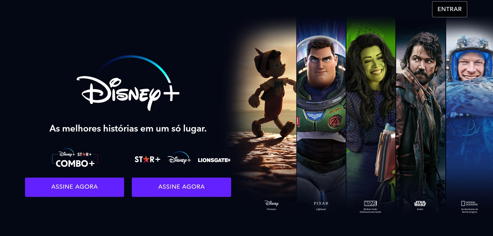

<h1 align="center"> Disney+ </h1>

Layout do Disney+ feito com HTML5 e CSS3

  <a href="#-tecnologias">Tecnologias</a>&nbsp;&nbsp;&nbsp;|&nbsp;&nbsp;&nbsp;
  <a href="#-Envolvidos no Projeto">Envolvidos no Projeto</a>&nbsp;&nbsp;&nbsp;|&nbsp;&nbsp;&nbsp;
  <a href="#-layout">Layout</a>&nbsp;&nbsp;&nbsp;

 

  

## 🚀 Tecnologias

Esse projeto foi desenvolvido com as seguintes tecnologias:

- HTML e CSS
- Git e GitHub

## 👥 Envolvidos no Projeto

- Fernanda Gomes  
    --> GitHub: https://github.com/fFernanda-gomes
- Bianca Carvalho  
    --> GitHub: https://github.com/biancacarvalhoo
- Maria Eduarda Loreta  
    --> GitHub: https://github.com/Maria-eduarda-loreta
- Maria Eduarda Santana  
    --> GitHub: https://github.com/MariaEduarda015

## 🔖 Layout

Você pode visualizar o layout do projeto através [DESSE LINK](https://www.disneyplus.com/pt-br). A versão do site em que replicamos é uma versão antiga do site oficial.

---

Feito com ♥